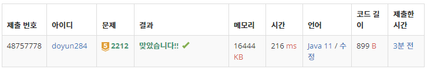

## 문제 유형
- 그리디 알고리즘
- 정렬

## 코드
```java
public static int solution(int N, int K, int[] arr) {
        Integer[] diff = new Integer[N-1];
        for (int i=0; i<N-1; i++) diff[i] = arr[i+1] - arr[i];

        int answer = 0;
        Arrays.sort(diff, Collections.reverseOrder());
        for (int i=K-1; i<N-1; i++) answer += diff[i];

        return answer;
}
```

## 로직
1. 입력 받은 센서 배열을 오름차순으로 정렬한다.
2. 인접한 두 센서 간의 차이를 diff 배열에 저장한다.
3. diff 배열을 내림차순으로 정렬한다.
4. K-1부터 N-1까지의 diff 값의 합이 정답 값이다.



## 리뷰
생각보다 까다로운 문제였다. 인접 센서간의 차이 값을 그리디에 이용하는 것을 생각해내기 까다로웠다.