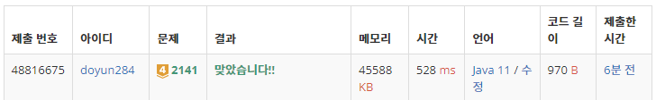

## 문제 유형
- 그리디 알고리즘
- 정렬

## 코드
```java
Arrays.sort(arr, (o1, o2) -> {
    if (o1[0] == o2[0]) return o1[1] - o2[1];
    return o1[0] - o2[0];
});

long mid = 0;
for (int[] village : arr) {
    mid += village[1];
    if (mid >= (sum) / 2) {
        System.out.println(village[0]);
        break;
    }
}
```

## 로직
1. 전체 인구 수를 sum 안에 저장한다. 이때, 각 마을의 인구수 범위가 1,000,000,000 이하이니 sum의 자료형을 long으로 지정한다.
2. 전체 인구 수의 중간 값에 해당하는 지점의 마을에 우체국을 세운다.



## 리뷰
그리디 문제를 해결할 때,  조금 더 기발하게 생각하도록 노력해야겠다.