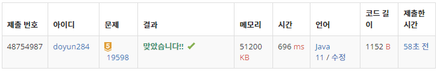

## 문제 유형
- 자료 구조
- 그리디 알고리즘
- 정렬
- 스위핑
- 우선순위 큐

## 코드
```java
public static int solution(int N, int[][] time) {
        Arrays.sort(time, (o1, o2) -> {
           if (o1[0] == o2[0]) return o1[1] - o2[1];
           return o1[0] - o2[0];
        });

        PriorityQueue<Integer> pqueue = new PriorityQueue<>();
        pqueue.offer(time[0][1]);

        for (int i=1; i<N; i++) {
        int[] meet = time[i];
           if (pqueue.peek() <= meet[0]) pqueue.poll();
           pqueue.offer(meet[1]);
        }

        return pqueue.size();
}
```

## 로직
1. 시작시간 순으로, 시작 시간이 같으면 종료시간 순으로 배열을 정렬한다.
2. 우선순위 큐를 이용해 배열을 모두 탐색한다.
   1. 우선순위 큐의 첫번째 원소가 현재 미팅의 시작 시간보다 같거나 작으면, 해당 원소를 제거한다.
   2. 현재 미팅의 종류 시간을 우선순위 큐에 삽입한다.



## 리뷰
배열을 정렬할 때 사용하는 다양한 표현 방법을 좀 더 공부해서, 상황에 적절하게 사용할 수 있도록 노력해야겠다.