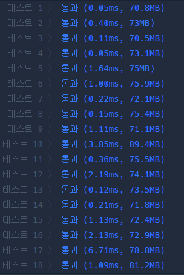

## 문제 유형
- 2022 KAKAO BLIND RECRUITMENT
- DP
- DFS

## 코드
```java
public void DFS(int idx, int sheep, int wolf, ArrayList<Integer> next, int[] info) {
    if (info[idx] == 0) sheep++;
    else wolf++;

    if (sheep <= wolf) return;
    answer = Math.max(sheep, answer);

    ArrayList<Integer> list = new ArrayList<>();
    list.addAll(next);
    list.remove(list.indexOf(idx));
    for (int i : arr.get(idx)) {
        list.add(i);
    }

    for (int i : list)
        DFS(i, sheep, wolf, list, info);
}
```

## 로직
1. 현재 idx 의 info 정보가 0일 경우 양을, 1일 경우 늑대를 증가시킨다.
2. 만약, 늑대의 수가 양과 같거나 크면 반환한다.
3. 정답 값을 가장 큰 양의 수로 갱신시킨다.
4. 현재 노드를 기준으로 다음으로 갈 수 있는 모든 노드의 정보를 저장한다.
5. 다음 노드 정보가 저장된 리스트를 기준으로 DFS 함수를 새로 호출한다.



## 리뷰
DP 문제인줄 모르고, 양들의 위치를 저장한 배열을 기준으로 각 양마다 DFS 함수를 돌려서 정답을 구했었다.
하지만 이 방법으로는 양들의 위치를 저장한 배열의 순서가 바뀔 때마다 정답이 바뀌었다.
DP를 적절하게 사용할 수 있도록 연습해야겠다.