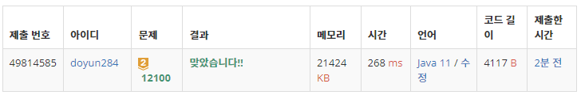

## 문제 유형
- 구현
- 브루트포스 알고리즘
- 시뮬레이션
- 백트래킹

## 코드
```java
static void DFS(int cur) {
    if (cur == 5) {
        answer = Math.max(answer, moveBlock());

    } else {
        for (int i=0; i<4; i++) {
            direction[cur] = i;
            DFS(cur + 1);
        }
    }
}

static int moveBlock() {
    int[][] newMap = new int[N][N];
    for (int i=0; i<N; i++) {
        System.arraycopy(map[i], 0, newMap[i], 0, N);
    }

    for (int k=0; k<5; k++) {
        if (direction[k] == 0) {
            for (int i=0; i<N; i++) {
                int idx = 0, block = 0;
                for (int j = 0; j < N; j++) {
                    if (newMap[j][i] == 0) continue;
                    if (newMap[j][i] == block) {
                        newMap[idx - 1][i] = block * 2;
                        newMap[j][i] = 0;
                        block = 0;
                    } else {
                        block = newMap[j][i];
                        newMap[j][i] = 0;
                        newMap[idx++][i] = block;
                    }
                }
            }
        }
        else if (direction[k] == 1) {
            for (int i = 0; i < N; i++) {
                int idx = 0, block = 0;
                for (int j = 0; j < N; j++) {
                    if (newMap[i][j] == 0) continue;
                    if (newMap[i][j] == block) {
                        newMap[i][idx - 1] = block * 2;
                        newMap[i][j] = 0;
                        block = 0;
                    } else {
                        block = newMap[i][j];
                        newMap[i][j] = 0;
                        newMap[i][idx++] = block;
                    }
                }
            }
        }
        else if (direction[k] == 2) {
            for (int i = 0; i < N; i++) {
                int idx = N - 1, block = 0;
                for (int j = N - 1; j >= 0; j--) {
                    if (newMap[j][i] == 0) continue;
                    if (newMap[j][i] == block) {
                        newMap[idx + 1][i] = block * 2;
                        newMap[j][i] = 0;
                        block = 0;
                    } else {
                        block = newMap[j][i];
                        newMap[j][i] = 0;
                        newMap[idx--][i] = block;
                    }
                }
            }
        }
        else {
            for (int i = 0; i < N; i++) {
                int idx = N - 1, block = 0;
                for (int j = N - 1; j >= 0; j--) {
                    if (newMap[i][j] == 0) continue;
                    if (newMap[i][j] == block) {
                        newMap[i][idx + 1] = block * 2;
                        newMap[i][j] = 0;
                        block = 0;
                    } else {
                        block = newMap[i][j];
                        newMap[i][j] = 0;
                        newMap[i][idx--] = block;
                    }
                }
            }
        }
    }

    int max = 0;
    for (int i=0; i<N; i++) {
        for (int j=0; j<N; j++) max = Math.max(newMap[i][j], max);
    }

    return max;
}
```

## 로직
1. DFS 함수를 이용해서 5번 움직일 수 있는 모든 경우의 수를 구한다.
2. 각각의 경우에서, 보드 내의 숫자들을 이동시킨다.
    1. 이전의 숫자를 저장할 block 변수를 선언한다.
    2. 만약 현재의 숫자가 block 수와 같다면, 이전 index의 위치에 block * 2를 저장한다.
    3. 만약 현재의 숫자가 block 수와 다르다면, 현재 index 위치에 block을 저장하고 index를 증가시킨다.
   


## 리뷰
어려웠다. 배열을 합치는 부분이 너무 까다로워서 결국 해설을 봤다. 사실 아직도 좀 아리까리해서 나중에 다시 찾아봐야겠다.