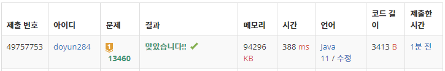

## 문제 유형
- 구현
- 그래프 이론
- 그래프 탐색
- 너비 우선 탐색
- 시뮬레이션

## 코드
```java
static int BFS() {
    int answer = 1;
    while (!queue.isEmpty()) {
        if (answer > 10) return -1;

        int len = queue.size();
        for (int i=0; i<len; i++) {
            int[] cur = queue.poll();

            for (int k=0; k<4; k++) {
                boolean isRedHole = false, isBlueHole = false;

                int nxR = cur[0];
                int nyR = cur[1];
                while (true) {
                    if (map[nxR][nyR] == 'O') isRedHole = true;
                    if (map[nxR + dx[k]][nyR + dy[k]] == '#') break;
                    nxR += dx[k];
                    nyR += dy[k];
                }

                int nxB = cur[2];
                int nyB = cur[3];
                while (true) {
                    if (map[nxB][nyB] == 'O') isBlueHole = true;
                    if (map[nxB + dx[k]][nyB + dy[k]] == '#') break;
                    nxB += dx[k];
                    nyB += dy[k];
                }

                if (isBlueHole) continue;
                if (isRedHole) return answer;

                if (nxR == nxB && nyR == nyB) {
                    if (k == 0) {           // 상
                        if (cur[0] < cur[2]) nxB -= dx[k];
                        else nxR -= dx[k];
                    }
                    else if (k == 1) {      // 좌
                        if (cur[1] < cur[3]) nyB -= dy[k];
                        else nyR -= dy[k];
                    }
                    else if (k == 2) {      // 하
                        if (cur[0] > cur[2]) nxB -= dx[k];
                        else nxR -= dx[k];
                    }
                    else {                  // 우
                        if (cur[1] > cur[3]) nyB -= dy[k];
                        else nyR -= dy[k];
                    }
                }

                queue.offer(new int[] {nxR, nyR, nxB, nyB});
            }
        }
        answer++;
    }

    return answer;
}
```

## 로직
1. 상하좌우 방향으로 현재 Red, Blue 구슬의 위치에서 각각의 구슬이 벽에 닿을때까지 기울인다.
   1. 이때, 각각의 구슬이 구멍에 빠질 경우 isRedHole, isBlueHole 변수를 통해 기록해 놓는다.
2. Blue 구슬이 구멍에 빠진 경우, 이는 제외한다.
3. Red 구슬이 구멍에 빠진 경우, 현재까지의 기울인 수(answer)를 반환한다.
4. Red, Blue 구슬의 위치가 같을 경우, 기울인 방향을 고려하여 위치를 조정해준다.
5. 새로운 구슬의 위치를 큐에 넣는다.
6. 기울인 수(answer)가 10을 초과할 경우 -1을 반환한다.



## 리뷰
제약 조건이 많은 구현 문제라서, 중간 중간에 빼먹고 실수하는 것이 많았다.
문제 조건들을 꼼꼼하게 읽고 제한 시간 안에 풀어내기 위한 연습을 해야겠다.