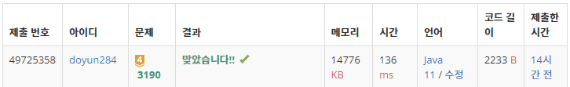

## 문제 유형
- 구현
- 자료 구조
- 시뮬레이션
- 덱
- 큐

## 코드
```java
public static boolean move() {
    int[] cur = deque.peek();
    int nx = cur[0] + dx[curDirection];
    int ny = cur[1] + dy[curDirection];

    if (nx < 1 || ny < 1 || nx >= N+1 || ny >= N+1) return false;

    for (int[] element : deque) {
        if (element[0] == nx && element[1] == ny) return false;
    }

    deque.addFirst(new int[]{nx, ny});
    if (map[nx][ny] != 1) deque.removeLast();
    else map[nx][ny] = 0;

    return true;
}
```

## 로직
1. 다음 뱀의 위치를 확인한다.
2. 만약 뱀이 벽에 부딪힐 경우, 게임을 종료한다.
3. 만약 뱀이 자신의 몸에 부딪힐 경우, 게임을 종료한다.
4. 새로운 위치를 dequeue 안에 넣는다.
5. 만약 사과를 먹었다면, map[nx][ny] = 0으로 변환한다.
6. 만약 사과를 먹지 않았다면, 꼬리 위치를 dequeue에서 뺀다.



## 리뷰
dequeue 자료구조를 이용하면 간단하게 풀리는 문제였다.
dequeue 사용 방법 및 함수 등을 자세히 공부해야겠다.