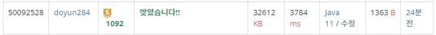

## 문제 유형
- 그리디 알고리즘
- 정렬

## 코드
```java
public static int solution() {
    int answer = 0;

    while (!box.isEmpty()) {
        int size = box.size();
        for (int i=0; i<N; i++) {
            for (Integer curBox : box) {
                if (curBox <= crane[i]) {
                    box.remove(curBox);
                    break;
                }
            }
        }
        if (size == box.size()) return -1;
        answer++;
    }

    return answer;
}
```

## 로직
1. 먼저 crane 배열과 box 배열을 내림차순으로 정렬한다.
2. crane 배열의 맨 앞에서부터 순회하면서 box 배열과 비교한다.
   1. crane 원소가 현재의 box 원소보다 같거나 크다면, 해당 box 원소를 제거한다.
3. 만약, 순회 후 box 배열의 크기가 이전과 같으면 더 이상 줄어들지 않는 것이니 -1을 반환한다.
4. 아니면, 정답을 1 증가시킨다.



## 리뷰
StringTokenizer 사용하면 시간초과가 나고, split 함수를 사용하면 통과했다.
인터넷 찾아보니 구분자가 1개인 경우 StringTokenizer 성능이 더 우세하다고 나와있었는데, 왜 이런 결과가 나왔는지 잘 모르겠다.
일반적으로 다들 위와 같은 알고리즘으로 해결했던데, 어떤 방식으로 풀어야 시간을 더 줄일 수 있을지 고민해봐야겠다.