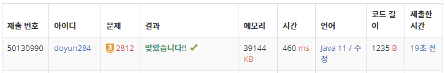

## 문제 유형
- 자료 구조
- 그리디 알고리즘
- 스택

## 코드
```java
public static String solution(int N, int K, int[] origin) {
    int cnt = 0;
    Stack<Integer> stack = new Stack<>();
    stack.push(origin[0]);

    for (int i=1; i<N; i++) {
        while (!stack.isEmpty() && cnt < K && stack.peek() < origin[i]) {
            stack.pop();
            cnt++;
        }

        stack.push(origin[i]);
    }

    if (cnt < K) {
        for (int i=cnt; i<K; i++) stack.pop();
    }

    StringBuilder sb = new StringBuilder();
    for (int i=0; i<N-K; i++) sb.append(stack.pop());
    return sb.reverse().toString();
}
```

## 로직
1. stack.peek()이 현재 값보다 작고, cnt < K 일때까지 stack에 pop하기
2. stack에 현재 원소 push하기
3. 전체 원소를 다 돌았는데, cnt < K일 경우 남은 횟수만큼 pop 하기



## 리뷰
그리디 문제는 쉬워보이고 코드도 몇 줄 안나오는데 진짜 까다롭다. 
처음에 반환값을 int로 했었는데, 입력값의 범위가 500,000 자리수이기에 정답 값이 int나 long보다 더 큰 범위일 수 있어서 틀렸다.
범위 항상 조심해야겠다.