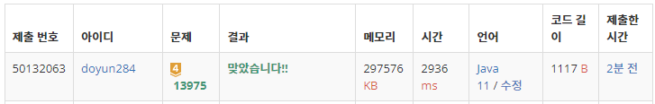

## 문제 유형
- 자료 구조
- 그리디 알고리즘
- 우선순위 큐

## 코드
```java
public static long solution(int K, long[] arr) {
    PriorityQueue<Long> pqueue = new PriorityQueue<>();
    for (int i=0; i<K; i++) pqueue.offer(arr[i]);

    long answer = 0;
    while (pqueue.size() > 1) {
        long newFile = pqueue.poll() + pqueue.poll();
        pqueue.offer(newFile);
        answer += newFile;
    }

    return answer;
}
```

## 로직
1. 우선순위 큐의 두 개의 원소 꺼내기
2. 두개의 합을 answer 변수에 더하고, 우선순위 큐에 합을 넣기
3. 우선순위 큐의 크기가 1 이하일 때까지 반복하기



## 리뷰
전형적인 우선순위 큐를 이용한 그리디 문제였다. 다만, 전체 총합인 answer의 범위가 1,000,000 * 10,000이기에 int의 범위를 넘어가서 long 자료형을 사용해줘야하는 점을 주위해야했다.