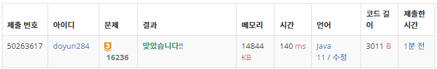

## 문제 유형
- 구현
- 그래프 이론
- 그래프 탐색
- 너비 우선 탐색
- 시뮬레이션

## 코드
```java
public static int solution(int N, int[][] map, int[] pos) {
    int shark = 2;
    map[pos[0]][pos[1]] = 0;

    while (check(N, map, shark)) {
        pos = getNextPos(N, shark, pos, map);
        if (pos == null) break;
        if (cnt >= shark) {
            cnt-= shark;
            shark++;
        }
    }
    return answer;
}

public static boolean check(int N, int[][] map, int shark) {
    for (int i=0; i<N; i++) {
        for (int j=0; j<N; j++) {
            if (map[i][j] != 0 && map[i][j] < shark) return true;
        }
    }
    return false;
}

public static int[] getNextPos(int N, int shark, int[] pos, int[][] map) {
    Queue<int[]> queue = new LinkedList<>();
    queue.offer(pos);

    boolean[][] visit = new boolean[N][N];
    visit[pos[0]][pos[1]] = true;

    int level = 0;
    while (!queue.isEmpty()) {
        int len = queue.size();
        for (int i=0; i<len; i++) {
            int[] cur = queue.poll();
            if (map[cur[0]][cur[1]] != 0 && map[cur[0]][cur[1]] < shark) {
                map[cur[0]][cur[1]] = 0;
                answer += level;
                cnt++;
                return cur;
            }
            for (int k=0; k<4; k++) {
                int nx = cur[0] + dx[k];
                int ny = cur[1] + dy[k];
                if (nx < 0 || ny < 0 || nx >= N || ny >= N || map[nx][ny] > shark) continue;
                if (!visit[nx][ny]) {
                    visit[nx][ny] = true;
                    queue.offer(new int[]{nx, ny});
                }
            }
        }
        level++;

        len = queue.size();
        PriorityQueue<int[]> pqueue = new PriorityQueue<>((o1, o2) -> {
            if (o1[0] == o2[0]) return o1[1] - o2[1];
            return o1[0] - o2[0];
        });
        for (int i=0; i<len; i++) pqueue.offer(queue.poll());
        for (int i=0; i<len; i++) queue.offer(pqueue.poll());
    }
    return null;
}
```

## 로직
1. check 함수를 통해 먹을 수 있는 물고기가 존재하는지 판단하기
2. 만약, 가능하다면 getNextPos 함수를 통해 물고기를 먹고 위치 이동
   1. BFS 이용해서 가장 가까운 물고기까지의 이동거리와 위치 얻기
   2. 이때, PriorityQueue 이용해서 상하좌우 매번 정렬하기
3. 상어가 물고기를 자신의 크기만큼 먹었다면 크기를 증가시키기 



## 리뷰
생각하기 까다로운 구현 문제였다. 진짜 조금만 잘못하면 실수하기 딱 좋은 문제인 것 같다.
Queue와 PriorityQueue 둘 다 사용하기 보다, PriorityQueue 안에 이동거리도 모두 저장해서 계산하는 방법도 좋을 것 같다.