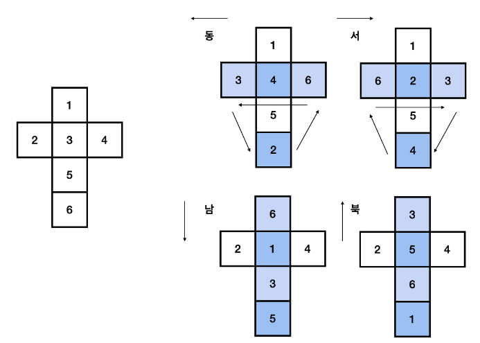
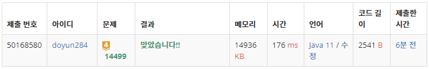

## 문제 유형
- 구현
- 시뮬레이션

## 코드
```java
public static int move(int direction) {
    int temp = dice[0];
    switch (direction) {
        case 1:     // 동쪽
            if (curY + 1 >= M) return -1;
            curY++;
            dice[0] = dice[3];
            dice[3] = dice[5];
            dice[5] = dice[2];
            dice[2] = temp;
            break;
        case 2:     // 서쪽
            if (curY -1 < 0) return -1;
            curY--;
            dice[0] = dice[2];
            dice[2] = dice[5];
            dice[5] = dice[3];
            dice[3] = temp;
            break;
        case 3:     // 북쪽
            if (curX -1 < 0) return -1;
            curX--;
            dice[0] = dice[4];
            dice[4] = dice[5];
            dice[5] = dice[1];
            dice[1] = temp;
            break;
        case 4:     // 남쪽
            if (curX + 1 >= N) return -1;
            curX++;
            dice[0] = dice[1];
            dice[1] = dice[5];
            dice[5] = dice[4];
            dice[4] = temp;
            break;
    }

    if (map[curX][curY] == 0) {
        map[curX][curY] = dice[5];
    }
    else {
        dice[5] = map[curX][curY];
        map[curX][curY] = 0;
    }

    return dice[0];
}
```

## 로직
1. 동서남북 방향을 기준으로 새로운 map 상의 위치를 구한다.
2. 주사위 전개도를 기반으로 새로운 주사위 전개도를 생성한다.
3. 만약, map의 원소가 0이라면 map에 현재 주사위 바닥면을 복사한다.
4. 아니라면, 주사위 바닥면에 현재 map 원소를 복사하고, map 원소를 0으로 바꾼다.

cf) 주사위 규칙 



## 리뷰
주사위가 회전하는 로직만 잘 파악하면 그 뒤의 구현은 간단한 문제였다. 주사위 회전 로직을 잘 기억해놔야겠다.