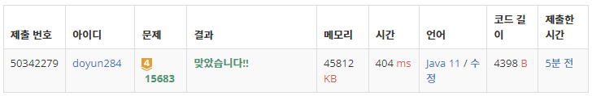

## 문제 유형
- 구현
- 브루트포스 알고리즘
- 시뮬레이션

## 코드
```java
public static void DFS(int cur) {
    if (cur == cctvs.size()) checkSpot();
    else{
        for (int i=0; i<cctvs.get(cur).caseCnt; i++) {
            directions[cur] = i;
            DFS(cur+1);
        }
    }
}

public static void checkSpot() {
    int[][] newMap = new int[N][M];
    for (int i=0; i<N; i++) {
        System.arraycopy(map[i], 0, newMap[i], 0, M);
    }

    for (int i=0; i<cctvs.size(); i++) {
        CCTV cctv = cctvs.get(i);
        int x = cctv.pos[0];
        int y = cctv.pos[1];

        if (cctv.type == 1) {
            while (x >= 0 && y >= 0 && x < N && y < M && newMap[x][y] != 6) {
                if (newMap[x][y] == 0) newMap[x][y] = -1;
                x += dx[directions[i]];
                y += dy[directions[i]];
            }
        }
        else if (cctv.type == 2) {
            for (int k=0; k<2; k++) {
                x = cctv.pos[0];
                y = cctv.pos[1];
                while (x >= 0 && y >= 0 && x < N && y < M && newMap[x][y] != 6) {
                    if (newMap[x][y] == 0) newMap[x][y] = -1;
                    x += dx[(directions[i] + 2*k) % 4];
                    y += dy[(directions[i] + 2*k) % 4];
                }
            }
        }
        else if (cctv.type == 3) {
            for (int k=0; k<2; k++) {
                x = cctv.pos[0];
                y = cctv.pos[1];
                while (x >= 0 && y >= 0 && x < N && y < M && newMap[x][y] != 6) {
                    if (newMap[x][y] == 0) newMap[x][y] = -1;
                    x += dx[(directions[i] + k) % 4];
                    y += dy[(directions[i] + k) % 4];
                }
            }
        }
        else if (cctv.type == 4) {
            for (int k=0; k<3; k++) {
                x = cctv.pos[0];
                y = cctv.pos[1];
                while (x >= 0 && y >= 0 && x < N && y < M && newMap[x][y] != 6) {
                    if (newMap[x][y] == 0) newMap[x][y] = -1;
                    x += dx[(directions[i] + k) % 4];
                    y += dy[(directions[i] + k) % 4];
                }
            }
        }
        else {
            for (int k=0; k<4; k++) {
                x = cctv.pos[0];
                y = cctv.pos[1];
                while (x >= 0 && y >= 0 && x < N && y < M && newMap[x][y] != 6) {
                    if (newMap[x][y] == 0) newMap[x][y] = -1;
                    x += dx[k];
                    y += dy[k];
                }
            }
        }
    }

    getBlindSpot(newMap);
}

public static void getBlindSpot(int[][] newMap) {
    int cnt = 0;
    for (int i=0; i<N; i++) {
        for (int j=0; j<M; j++) {
            if (newMap[i][j] == 0) cnt++;
        }
    }
    answer = Math.min(cnt, answer);
}
```

## 로직
1. DFS 함수를 통해 가능한 CCTV 방향의 조합을 구한다.
2. checkSpot 함수를 통해 CCTV 방향에 따른 감시 지대를 확인한다.
3. getBlindSpot 함수를 통해 현재 CCTV 조합의 사각지대를 구해서 사각지대의 최솟값(정답)을 갱신한다.



## 리뷰
이것 또한 간단한 구현 문제였다. 회전에 따른 모든 경우의 수를 low한 단계에서 다 확인해보는 것이 중요할 것 같다.