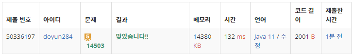

## 문제 유형
- 구현
- 시뮬레이션

## 코드
```java
static int solution(int x, int y, int direction) {
    int answer = 0, cnt = 0;

    while (true) {
        if (!visit[x][y]) {
            answer++;
            visit[x][y] = true;
        }

        direction = (direction + 3) % 4;
        int nx = x + dx[direction];
        int ny = y + dy[direction];
        cnt++;

        if (map[nx][ny] == 0 && !visit[nx][ny]) {
            x = nx;
            y = ny;
            cnt = 0;
            continue;
        }

        if (cnt == 4) {
            int back = (direction + 2) % 4;
            int backX = x + dx[back];
            int backY = y + dy[back];
            if (backX < 0 || backY < 0 || backX >= N || backY >= M || map[backX][backY] == 1) break;
            else {
                x = backX;
                y = backY;
                cnt = 0;
            }
        }
    }

    return answer;
}
```

## 로직
1. 현재 위치를 청소
2. 현재 위치에서 현재 방향을 기준으로 반시계방향으로 차례대로 탐색을 진행
   1. 왼쪽 방향에 아직 청소하지 않은 공간이 존재한다면, 그 방향으로 회전하고 1번부터 진행
   2. 왼쪽 방향에 청소할 공간이 없다면, 그 방향으로 회전하고 2번부터 진행
3. 네 방향 모두 청소가 이미 되어있거나 벽인 경우에는, 바라보는 방향을 유지한 채로 한 칸 후진하고 2번부터 진행
4. 네 방향 모두 청소가 이미 되어있거나 벽이면서, 뒤쪽 방향이 벽이라 후진도 할 수 없는 경우에는 작동 중지



## 리뷰
방향만 잘 조절하면 되는 구현문제였다. 방향이나 로직이 꼬이지 않도록 조심해야겠다.