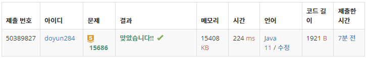

## 문제 유형
- 구현
- 브루트포스 알고리즘
- 백트래킹

## 코드
```java
static void DFS(int cnt, int depth) {
    if (cnt == M) answer = Math.min(getChickenDistance(), answer);
    else {
        for (int i=depth; i< chicken.size(); i++) {
            visit[i] = true;
            DFS(cnt+1, i+1);
            visit[i] = false;
        }
    }
}

static int getChickenDistance() {
    int distance = 0;

    for (int[] h : house) {
        int curDistance = Integer.MAX_VALUE;
        for (int i=0; i<chicken.size(); i++) {
            if (visit[i]) {
                int[] c = chicken.get(i);
                int temp = Math.abs(c[0] - h[0]) + Math.abs(c[1] - h[1]);
                curDistance = Math.min(temp, curDistance);
            }
        }
        distance += curDistance;
    }

    return distance;
}
```

## 로직
1. DFS 함수를 통해 가능한 M개의 치킨집의 조합을 구한다.
2. 각각의 조합에서 모든 집의 치킨거리를 계산해서 도시 전체의 치킨거리를 구한다.
3. 가장 작은 도시 전체의 치킨거리를 구한다. 



## 리뷰
브루트포스 알고리즘이여서 위에 코드와 같이 DFS 후 치킨 거리를 체크해도 시간초과가 안났던 것 같다.
DFS 함수를 돌리는 동시에 치킨거리를 계산하는 방식으로 알고리즘을 수정하면 시간이 줄어들 것 같다.