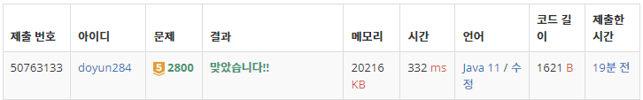

## 문제 유형
- 자료 구조
- 문자열
- 스택
- 재귀

## 코드
```java
public static ArrayList<int[]> getPair(String str) {
    ArrayList<int[]> pair = new ArrayList<>();
    Stack<Integer> stack = new Stack<>();

    for (int i=0; i<str.length(); i++) {
        if (str.charAt(i) == '(') stack.push(i);
        if (str.charAt(i) == ')') pair.add(new int[]{stack.pop(), i});
    }

    return pair;
}

public static void DFS(int cur, String str) {
    if (cur == pair.size()) getStr(str);
    else {
        check[cur] = true;
        DFS(cur+1, str);
        check[cur] = false;
        DFS(cur+1, str);
    }
}

public static void getStr(String str) {
    StringBuilder sb = new StringBuilder(str);

    int cnt = 0;
    for (int i=0; i<pair.size(); i++) {
        if (check[i]) {
            sb.setCharAt(pair.get(i)[0], ' ');
            sb.setCharAt(pair.get(i)[1], ' ');
            cnt++;
        }
    }

    if (cnt == 0) return;
    String newStr = sb.toString().replaceAll("\\s", "");
    answer.add(newStr);
}
```

## 로직
1. 먼저 getPair 함수를 통해 괄호의 올바른 짝을 구해서 저장한다.
2. DFS 함수를 통해 괄호 짝의 조합을 구한다.
3. getStr 함수를 통해 각각의 괄호 짝의 조합에서 새로운 문자열을 추출한다.
   1. 이때, 새로운 문자열은 중복될 수 있기에 TreeSet 자료구조를 이용하여 저장하고 자동으로 정렬한다.



## 리뷰
간단한 스택 + 재귀 문제였다. 정답으로 나오는 새로운 문자열이 중복될 수도 있다는 사실에 주의해야겠다.