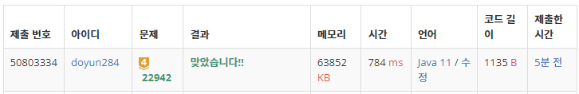

## 문제 유형
- 자료 구조
- 정렬
- 기하학
- 스위핑
- 스택

## 코드
```java
static boolean solution(int N, int[][] arr) {
    int[] prev = new int[] {Integer.MIN_VALUE, Integer.MIN_VALUE};

    for (int[] cur : arr) {
        if (cur[0] <= prev[1] && prev[1] <= cur[1]) return false;
        prev = cur;
    }

    return true;
}
```

## 로직
1. 각각의 원이 x축과 닿는 점을 순서대로 저장한 후 정렬한다.
2. 모든 원을 solution 함수를 통해 순차적으로 탐색한다.
   1. 만약, 이전 원의 오른쪽 좌표보다 현재 원의 왼쪽 좌표가 작거나 같고 이전 원의 오른쪽 좌표보다 현재 좌표의 오른쪽 좌표가 크거나 같으면 교점이 발생한다.
   2. 아닐 경우, 이전 원에 현재 원을 저장한다.



## 리뷰
처음에는 2중 for문을 돌면서 모든 원들 사이에 거리를 체크했는데 시간초과가 났다.
그 후에는 for문을 한번만 돌도록 알고리즘을 수정하였더니 성공하였다.
최대한 시간을 줄이는 방향으로 알고리즘을 생각하도록 해야겠다.