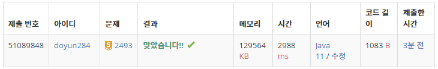

## 문제 유형
- 자료 구조
- 스택

## 코드
```java
public static int[] solution(int N, int[] tops) {
    int[] answer = new int[N];

    Stack<int[]> stack = new Stack<>();
    for (int i=0; i<N; i++) {
        while (!stack.isEmpty()) {
            if (stack.peek()[1] < tops[i]) stack.pop();
            else {
                answer[i] = stack.peek()[0];
                break;
            }
        }
        if (stack.isEmpty()) answer[i] = 0;
        stack.push(new int[]{i+1, tops[i]});
    }

    return answer;
}
```

## 로직
1. 스택이 빌 때까지 반복하여 현재 탑의 레이저를 수신할 다른 탑의 위치를 찾는다.
   1. 만약, 현재의 탑보다 스택 맨 위의 원소가 작다면 현재 탑의 레이저가 그냥 지나치게 되므로 스택 pop
   2. 아니라면, 현재 탑의 레이저가 도달한 것이므로 정답 값에 스택 맨 위 원소의 번호 저장 후 break;
2. 만약 1 과정을 진행 후 스택이 비게 된다면 현재 탑의 레이저가 도달하는 곳이 없으므로 정답 값에 0 저장
3. 스택에 현재의 번호와 높이 저장



## 리뷰
스택을 이용한 문제였는데, 생각해내기가 좀 까다로웠다.
pop과 push하는 코드의 위치를 정하는 것을 꼼꼼하게 생각해야겠다.