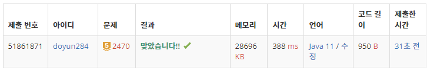

## 문제 유형
- 정렬
- 이분 탐색
- 두 포인터

## 코드
```java
int min = Integer.MAX_VALUE;
int[] answer = new int[2];

int left = 0, right = N-1;
while (left < right) {
    int sum = arr[left] + arr[right];
    if (Math.abs(sum) < min) {
        min = Math.abs(sum);
        answer[0] = arr[left];
        answer[1] = arr[right];
    }
    if (sum > 0) right--;
    else left++;
}
```

## 로직
1. 만약, arr[left] + arr[right]의 절대값이 저장되어있는 최소 절댓값보다 작다면 교체
2. 만약, arr[left] + arr[right]이 0보다 크다면 right 줄이기
3. 만약, arr[left] + arr[right]이 0보다 작다면 left 증가 



## 리뷰
처음에는 sum이 0보다 크면 left를 늘려야한다고 생각했었다.
하지만 그 방식으로 하면 모든 용액이 양수이거나 모든 용액이 음수일 때 포인터 관리가 제대로 되지 않는다.
포인터 증감 관리할 때, 방향이나 조건문을 잘 작성하도록 노력해야겠다 .... !!!