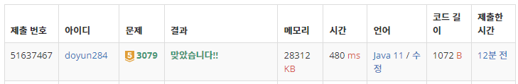

## 문제 유형
- 이분 탐색
- 매개 변수 탐색

## 코드
```java
public static long solution(int N, int M, int[] times) {
    long answer = 0;
    long start = 1, end = (long) times[N - 1] * M;

    while (start <= end) {
        long mid = (start + end) / 2;

        long sum = 0;
        for (int time : times) sum += mid / time;

        if (sum >= M) {
            end = mid - 1;
            answer = mid;
        }
        else start = mid + 1;
    }

    return answer;
}
```

## 로직
- 이분탐색할 것: 심사를 받는데 걸리는 시간(mid)
- 비교대상: M(입국심사를 기다리는 사람)
1. 각 mid에서 주어진 시간동안 몇명 검사할 수 있는지 누적한다.
2. 만약, 검사 가능 인원이 비교 대상(M)보다 크거나 같다면 end를 줄인다.
3. 만약, 검사 가능 인원이 비교 대상(M)보다 작다면 start를 늘린다.



## 리뷰
일반적인 이분탐색에서 넘어서 매개 변수 탐색을 생각해내는 것은 아직 좀 어려운 것 같다.
좀 더 연습해야겠다 ....