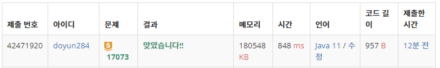

## 문제 유형
- 수학
- 그래프 이론
- 그래프 탐색
- 트리

## 코드
```java
ArrayList<Integer>[] tree = new ArrayList[N+1];
for (int i=1; i<=N; i++) tree[i] = new ArrayList<>();

for (int i=0; i<N-1; i++) {
    st = new StringTokenizer(br.readLine());
    int a = Integer.parseInt(st.nextToken());
    int b = Integer.parseInt(st.nextToken());
    tree[a].add(b);
    tree[b].add(a);
}

int leafNode = 0;
for (int i=2; i<=N; i++) {
    if (tree[i].size() == 1) leafNode++;
}
```

## 로직
1. 입력 받을 때, tree ArrayList 배열에 서로의 값을 넣어 준다
2. tree ArrayList 사이즈가 1인 원소는 부모와만 연결되어있다. 즉, leaf node 이다.
3. 전체 물의 무게 (W)를 leafNode 개수로 나눈다.



## 리뷰
트리 문제일 줄 알았는데, 트리보다는 수학에 치중된 문제인 것 같아서 아쉽다.