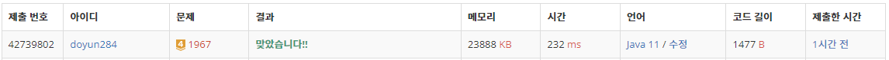

## 문제 유형
- 그래프 이론
- 그래프 탐색
- 트리
- 깊이 우선 탐색

## 코드
```java
import java.util.*;
import java.io.*;

class Node {
    int vertex, weight;

    Node(int v, int w) {
        this.vertex = v;
        this.weight = w;
    }
}

class B1967 {
    public static ArrayList<ArrayList<Node>> tree;
    public static int[] visited;
    public static int max_idx, answer = Integer.MIN_VALUE;

    public static void DFS(int cur, int sum) {
        if (answer < sum) {
            answer = sum;
            max_idx = cur;
        }

        visited[cur] = 1;
        for (Node x : tree.get(cur)) {
            if (visited[x.vertex] == 0)
                DFS(x.vertex, sum + x.weight);
        }
        visited[cur] = 0;
    }

    public static void main(String[] args) throws IOException {
        BufferedReader br = new BufferedReader(new InputStreamReader(System.in));
        int n = Integer.parseInt(br.readLine());

        tree = new ArrayList<>();
        for (int i=0; i<=n; i++) tree.add(new ArrayList<>());

        StringTokenizer st;
        for (int i=0; i<n-1; i++) {
            st = new StringTokenizer(br.readLine());
            int a = Integer.parseInt(st.nextToken());
            int b = Integer.parseInt(st.nextToken());
            int w = Integer.parseInt(st.nextToken());
            tree.get(a).add(new Node(b, w));
            tree.get(b).add(new Node(a, w));
        }

        visited = new int[n+1];
        DFS(1, 0);

        visited = new int[n+1];
        DFS(max_idx, 0);
        System.out.println(answer);
    }
}
```

## 로직
1. root 노드에서 깊이 우선 탐색을 진행하여, 거리가 가장 먼 말단 노드를 찾는다.
2. 찾은 말단 노드에서 다시 DFS 진행하여, 최대 지름의 길이를 구한다. 



## 리뷰
- 처음에는 leafNode 모두 구한 후, 깊이 우선 탐색을 이용하여 2개의 leafNode 사이의 최대 길이를 구하였다.
하지만, 이 방법은 경우의 수가 너무 많고 2중 for 문을 돌기에 시간 초과가 났다.
- 위의 문제를 해결한 로직이 모든 테스트 케이스를 통과할 수 있을지는 의문이긴 하다. 