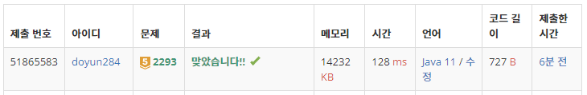

## 문제 유형
- 다이나믹 프로그래밍

## 코드
```java
dp[0] = 1;
for (int i=0; i<N; i++) {
    for (int j=arr[i]; j<=K; j++) {
        dp[j] += dp[j - arr[i]];
    }
}
```

## 로직
- 점화식: dp[j] = dp[j] + dp[j-arr[i]]



## 리뷰
DP 진짜 너무 어렵다 ..  
다이나믹하게 생각하는 방법 좀 연습해야겠다 ..