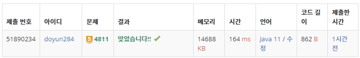

## 문제 유형
- 다이나믹 프로그래밍

## 코드
```java
public static long[] solution() {
    long[] dp = new long[31];
    dp[0] = 1;
    dp[1] = 1;
    dp[2] = 2;

    for (int i=3; i<=30; i++) {
        long cnt = 0;
        for (int j=0; j<i; j++) {
            cnt += dp[j] * dp[i-1-j];
        }
        dp[i] = cnt;
    }

    return dp;
}
```

## 로직
- 점화식: dp[i] += dp[j] * dp[i-1-j]



## 리뷰
디피 .. 넘 어려운것같다.
범위도 잘 고려할 수 있도록 노력해야겠다.