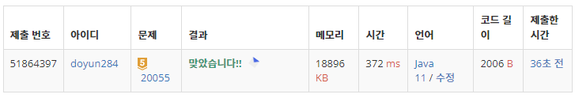

## 문제 유형
- 구현
- 시뮬레이션

## 코드
```java
public static int solution(int N, int K, int[] belt) {
    int answer = 0;
    boolean[] robot = new boolean[N];

    while (checkBelt(K, belt)) {

        // 1. 벨트가 각 칸 위에 있는 로봇과 함께 한 칸 회전
        int temp = belt[2 * N - 1];
        for (int i=2*N-1; i>0; i--) belt[i] = belt[i-1];
        belt[0] = temp;
        for (int i=N-1; i>0; i--) robot[i] = robot[i-1];
        robot[0] = false;

        // 2. 가장 먼저 벨터에 올라간 로봇부터, 벨트가 회전하는 방향으로 한 칸 이동
        robot[N-1] = false;
        for (int i=N-2; i>0; i--) {
            if (robot[i] && !robot[i+1] && belt[i+1] > 0) {
                robot[i] = false;
                robot[i+1] = true;
                belt[i+1]--;
            }
        }

        // 3. 올리는 위치에 있는 칸의 내구도가 0이 아니라면 로봇 올림
        if (belt[0] > 0) {
            robot[0] = true;
            belt[0]--;
        }

        answer++;
    }

    return answer;
}

public static boolean checkBelt(int K, int[] belt) {
    int cnt = 0;

    for (int cur : belt) {
        if (cur == 0) cnt++;
        if (cnt == K) return false;
    }

    return true;
}
```

## 로직
- 내구도가 0인 것이 K개 미만일 경우 반복
  1. 벨트가 각 칸 위에 있는 로봇과 함께 한 칸 회전
  2. 가장 먼저 벨터에 올라간 로봇부터, 벨트가 회전하는 방향으로 한 칸 이동
  3. 올리는 위치에 있는 칸의 내구도가 0이 아니라면 로봇 올림



## 리뷰
구현 문제는 중간에 조건 하나 빠뜨리지 않도록 조심해야겠다.