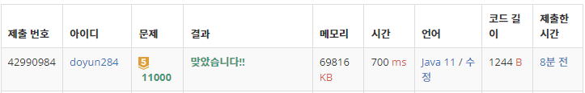

## 문제 유형
- 그리디 알고리즘
- 정렬
- 우선순위 큐

## 코드
```java
Collections.sort(arr);
PriorityQueue<Integer> pq = new PriorityQueue<>();
pq.offer(arr.get(0).end);

for (int i=1; i<arr.size(); i++) {
    if (arr.get(i).start >= pq.peek()) pq.poll();
    pq.offer(arr.get(i).end);
}
```

## 로직
1. 시작 시간을 기준으로 강의 배열 정렬
2. 강의 배열의 첫번째 원소의 종료 시점을 우선순위 큐에 삽입
3. 강의 배열을 돌면서 탐색
    - 만약, 현재의 원소의 시작 시점이 우선순위 큐 첫번째 원소보다 같거나 크다면 poll
    - 현재 원소의 종료 시점 offer



## 리뷰
처음에 priorityQueue 사용하지 않고, 이중 for문 돌면서 직접 정렬을 하고 비교를 계속 하니 시간초과가 났다. <br>
좀만 더 깊게 생각해서 시간초과 안나도록 조심해야겠다.