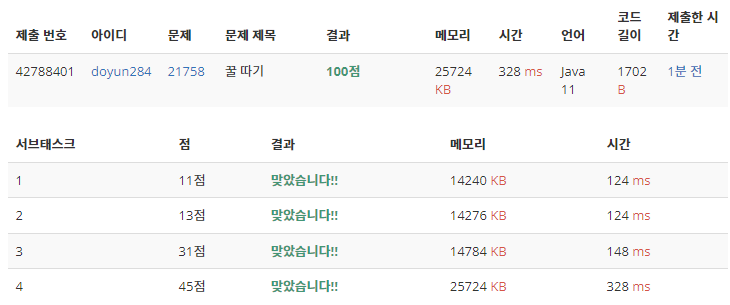

## 문제 유형
- 그리디 알고리즘
- 누적 합
- 많은 조건 분기

## 코드
```java
public static int honey() {
    int answer = 0;
    
    totalLeft = new int[N];
    totalLeft[0] = 0;
    for (int i=1; i<N; i++) {
        totalLeft[i] = totalLeft[i-1] + arr[i-1];
    }
    
    totalRight = new int[N];
    totalRight[N-1] = 0;
    for (int i=N-2; i>=0; i--) {
        totalRight[i] = totalRight[i+1] + arr[i+1];
    }
    
    // 1. 벌 벌 벌통
    for (int i=1; i<N-1; i++) {
        int bee1 = total - arr[0] - arr[i];
        int bee2 = totalRight[i];
        answer = Math.max(answer, bee1 + bee2);
    }
    
    // 2. 벌통 벌 벌
    for (int i=N-2; i>0; i--) {
        int bee1 = total - arr[N-1] - arr[i];
        int bee2 = totalLeft[i];
        answer = Math.max(answer, bee1 + bee2);
    }
    
    // 3. 벌 벌통 벌
    for (int i=1; i<N-1; i++) {
        int bee1 = totalLeft[i] - arr[0] + arr[i];
        int bee2 = totalRight[i] - arr[N-1] + arr[i];
        answer = Math.max(answer, bee1 + bee2);
    }
    
    return answer;
}
```

## 로직
- 총 3가지 경우로 나눠서 생각하였다.
  1. [벌 벌 벌통]인 경우
     - 첫번째 벌은 왼쪽 끝
     - 벌통은 오른쪽 끝
     - 두번쨰 벌은 그 사이 값
  2. [벌통 벌 벌]인 경우
     - 벌통은 왼쪽 끝
     - 두번쨰 벌은 오른쪽 끝
     - 첫번째 벌은 그 사이 값
  3. [벌 벌통 벌]인 경우
     - 첫번째 벌은 왼쪽 끝
     - 두번째 벌은 오른쪽 끝
     - 벌통은 그 사이 값



## 리뷰
생각보다 고려해야 할 조건이 많아서 까다로웠다. 자칫하면 실수할 수도 있는 문제 같다.
