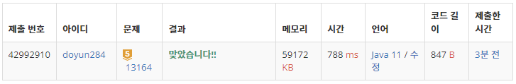

## 문제 유형
- 그리디 알고리즘
- 정렬

## 코드
```java
ArrayList<Integer> diff = new ArrayList<>();
for (int i=0; i<N-1; i++) {
    diff.add(arr[i+1] - arr[i]);
}

int answer = 0;
Collections.sort(diff);
for (int i=0; i<N-K; i++) answer += diff.get(i);
```

## 로직
- 인접한 친구끼리의 차이를 모두 구하여, 이를 오름차순으로 정렬한다.
  - 하나의 그룹 안에서 차이들을 모두 더하면, 가장 작은 원소와 가장 큰 원소의 차이가 구해진다.
- N-K개의 차이를 더하면 정답을 구할 수 있다.
  - 인접한 그룹과 1번 합치면 N-1개의 그룹이 남는다.
  - 인접한 그룹과 N-K번을 합치면 K개의 그룹이 남는다.



## 리뷰
도저히 모르겠어서 풀이 참고하였는데, 진짜 생각 자체가 너무 기발한 것 같다.
이렇게 생각해내기도 쉽지 않을 것 같다. .