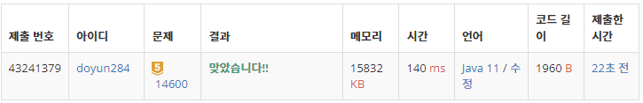

## 문제 유형
- 분할 정복
- 구현

## 코드
```java
public static int[][] tile;
public static int num = 1;

public static boolean check(int x, int y, int len){
    int cur = tile[x][y];
    for (int i=x; i<x+len; i++) {
        for (int j=y; j<y+len; j++) {
            if (tile[i][j] != cur) return false;
        }
    }
    return true;
}

public static void fillNum(int x, int y) {
    for (int i=x; i<x+2; i++) {
        for (int j=y; j<y+2; j++) {
            if (tile[i][j] == 0) tile[i][j] = num;
        }
    }
    num++;
}

public static void L_Tromino(int x, int y, int len) {
    if (len == 2) fillNum(x, y);
    else {
        int curLen = len/2;
        if (check(x, y, curLen)) tile[curLen][curLen] = num;
        if (check(x, y+curLen, curLen)) tile[curLen][curLen+1] = num;
        if (check(x+curLen, y, curLen)) tile[curLen+1][curLen] = num;
        if (check(x+curLen, y+curLen, curLen)) tile[curLen+1][curLen+1] = num;
        num++;
    
        L_Tromino(x, y, curLen);
        L_Tromino(x, y+curLen, curLen);
        L_Tromino(x+curLen, y, curLen);
        L_Tromino(x+curLen, y+curLen, curLen);
    }
}
```

## 로직
1. 정사각형 배열을 4분할한다.
2. 각 사분면의 모든 원소가 같은지 체크한다.
    - 모두 같을 경우, 서로 맡닿아있는 사분면의 꼭짓점에 num 값을 채워넣는다.
    - 모두 같지 않을 경우, 타일링 조건을 만족한 것으로 간주하고 통과한다. 
3. 위의 방법을 반복하고, 길이가 2면 타일을 채워넣는다.



## 리뷰
이 문제를 통해 L-Tromino 타일링 알고리즘에 대해 알게 되었다. 