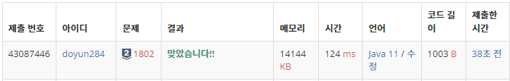

## 문제 유형
- 문자열
- 분할 정복

## 코드
```java
public static void paper(String arr, int mid, int cnt) {
   if (mid == 0) {
      answer[cnt] = "YES";
      return;
   }
   
   for (int i=0; i<mid; i++) {
      if (arr.charAt(i) == arr.charAt(arr.length() - 1 - i)) {
         return;
      }
   }
   
   paper(arr.substring(0, mid), mid/2, cnt);
}
```

## 로직
- 중간 값을 기준으로 대칭적인 위치에 있는 숫자는 서로 달라야 한다.



## 리뷰
생각보다 간단한 분할 정복 문제였다. 분할 정복 범위 나누는 실수만 하지 않으면 될 것 같다.