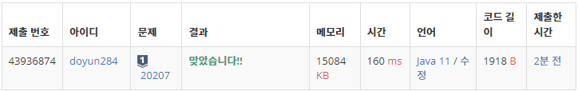

## 문제 유형
- 그리디 알고리즘
- 구현
- 정렬

## 코드
```java
Collections.sort(arr);
int[] dp = new int[maxDay + 2];
PriorityQueue<Integer> pqueue = new PriorityQueue<>();

for (Schedule s : arr) {
    if (pqueue.isEmpty()) pqueue.offer(s.end);
    else {
        if (pqueue.peek() < s.start) pqueue.poll();
        pqueue.offer(s.end);
    }
    for (int i=s.start; i<=s.end; i++) dp[i]++;
}

int answer = 0;
int length = 0, height = 0;
for (int i=minDay; i<=maxDay+1; i++) {
    if (dp[i] == 0) {
        answer += length * height;
        length = 0;
        height = 0;
    }
    else {
        length++;
        height = Math.max(height, dp[i]);
    }
}
```

## 로직
1. Schedule 배열 정렬
2. PriorityQueue 사용해서 일정 배치하기
3. dp 배열에 해당 날짜의 일정 개수 저장



## 리뷰
간단한 그리디 & 정렬 문제인 줄 알았는데, dp 배열까지 신경써야했다. 
좀 더 꼼꼼하게 문제를 봐야겠다 .. !!