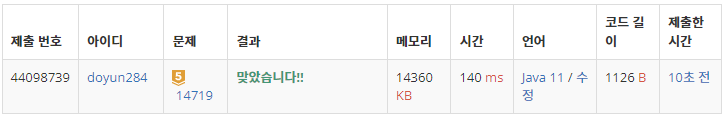

## 문제 유형
- 구현
- 시뮬레이션

## 코드
```java
for (int i=1; i<N-1; i++) {
    int cur = arr[i];
    int minLeft = cur;
    int minRight = cur;
    
    for (int j=0; j<i; j++) {
        if (arr[j] > cur) minLeft = Math.max(minLeft, arr[j]);
    }
    for (int j=i+1; j<N; j++) {
        if (arr[j] > cur) minRight = Math.max(minRight, arr[j]);
    }
    
    if (Math.min(minLeft, minRight) > cur)
        answer += Math.min(minLeft, minRight) - cur;
}
```

## 로직
1. 왼쪽과 오른쪽의 최대 벽의 길이를 각각 구한다.
2. 둘 중 작은 벽의 크기만큼 더한다.



## 리뷰
쉬워보였는데, 생각보다 훨씬 어려운 문제였다. 
전체적으로 생각하지 말고, 부분적으로 나눠서 생각하는 연습을 해야겠다.