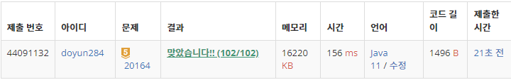

## 문제 유형
- 구현
- 재귀
- 브루트포스

## 코드
```java
public static int getOdd(int N) {
    int num = 0;

    while (N > 0) {
        int curDigit = N % 10;
        if (curDigit % 2 != 0) num++;
        N /= 10;
    }
    return num;
}

public static void getFunc(int N, int cnt) {
    int odd = getOdd(N);

    if (N < 10) {
        min = Math.min(min, cnt + odd);
        max = Math.max(max, cnt + odd);
    }
    else if (N < 100) {
        getFunc(N % 10 + N / 10, cnt + odd);
    }
    else {
        String str = Integer.toString(N);
        for (int i=0; i<str.length()-2; i++) {
            for (int j=i+1; j<str.length()-1; j++) {
                String s1 = str.substring(0, i + 1);
                String s2 = str.substring(i + 1, j + 1);
                String s3 = str.substring(j + 1);

                int next = Integer.parseInt(s1) + Integer.parseInt(s2) + Integer.parseInt(s3);
                getFunc(next, cnt + odd);
            }
        }

    }
}
```

## 로직
1. N이 한자리수 일 때, 최소값/최대값 구하기
2. N이 두자리수 일 때, 각 자리수 더한 뒤 재귀 호출
3. N이 세자리수 일 때, 모든 가능한 경우로 숫자 3개 만든 후 재귀 호출



## 리뷰
brute force 알고리즘 문제였다. 좀 더 효율적으로 짤 수 없나 생각해봐야겠다.