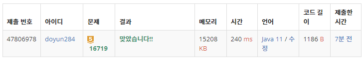

## 문제 유형
- 구현
- 문자열
- 재귀

## 코드
```java
public static void ZOAC(List<Char> temp) {
        if (temp.isEmpty()) return;

        Char cur = temp.get(0);
        for (Char item : temp) {
            if (cur.c > item.c) cur = item;
        }

        answer[cur.index] = cur.c;
        for (int i=0; i<answer.length; i++) {
            if (answer[i] != null) System.out.print(answer[i]);
        }
        System.out.println();

        ZOAC(temp.subList(temp.indexOf(cur) + 1, temp.size()));
        ZOAC(temp.subList(0, temp.indexOf(cur)));
}
```

## 로직
1. Char 클래스 이용해서 문자와 해당 문자의 index 저장한 배열 생성
2. for 문 돌면서, 사전 순으로 가장 작은 문자 찾기
3. 가장 작은 문자를 정답 배열에 저장. 이때, 해당 문자의 index 위치에 저장
4. 가장 작은 문자 기준으로 뒤쪽 문자열 재귀
5. 가장 작은 문자 기준으로 앞쪽 문자열 재귀



## 리뷰
초기 문자열 순서에 맞춰서 출력을 하는 것이 힘들었다. 진작 class 이용할 걸 그랬다.