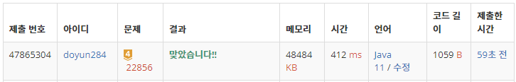

## 문제 유형
- 그래프 이론
- 그래프 탐색
- 트리

## 코드
```java
public static void traversal(int cur) {
    if (tree[cur][0] != -1) {
        answer++;
        traversal(tree[cur][0]);
    }
    visit++;
    if (tree[cur][1] != -1) {
        answer++;
        traversal(tree[cur][1]);
    }
    if (visit != N) answer++;
}
```

## 로직
1. N 크기의 배열 안에 left child, right child 저장한다.
2. root(node 1)에서 시작하여, 왼쪽 자식 -> 자기 자신 -> 오른쪽 자식 순으로 탐색한다.
   1. 왼쪽 자식이 존재할 경우, 이동 횟수 증가 시키고 재귀 함수 호출
   2. 방문한 노드 개수 증가
   3. 오른쪽 자식이 존재할 경우, 이동 횟수 증가 시키고 재귀 함수 호출



## 리뷰
