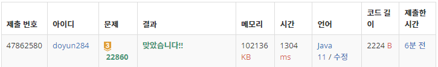

## 문제 유형
- 구현
- 해시를 사용한 집합과 맵
- 파싱
- 자료 구조

## 코드
```java
public static HashMap<String, Integer> arrangement(String query) {
        String[] folders = query.split("/");
        Stack<String> stack = new Stack<>();
        stack.push(folders[folders.length-1]);

        HashMap<String, Integer> info = new HashMap<>();
        while (!stack.isEmpty()) {
            String curD = stack.pop();
            if (directory.get(curD) == null) continue;

            for (Data data : directory.get(curD)) {
                if (data.isFolder == 1) stack.push(data.name);
                else {
                    info.put(data.name, info.getOrDefault(data.name, 0) + 1);
                }
            }
        }

        return info;
}
```

## 로직
1. 입력받을 때, HashMap 활용하여 상위 폴더 각각의 자식 데이터들을 ArrayList로 저장한다.
2. 각각의 쿼리를 "/" 기준으로 분리하여, 가장 마지막 폴더의 이름을 획득한다.
3. 해당 폴더 하위에 존재하는 파일 종류 및 개수를 정리한다.
   1. 폴더일 경우, stack 안에 저장한다.
   2. 파일일 경우, hashMap 안에 저장한다.



## 리뷰
NullPointerException 때문에 애를 먹었다. 
트리 구조 순서대로 입력이 들어오지 않는 경우도 있기 떄문에, 입력 받는 순서대로 객체를 생성할 경우 해당 에러가 발생했다. 
입력 받는 데이터의 자료 구조를 모두 연결시켜 놓지 않고, 포인터를 활용해 연결하도록 생각하는 연습을 해야겠다.