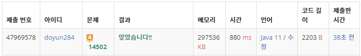

## 문제 유형
- 구현
- 그래프 이론
- 브루트포스 알고리즘
- 그래프 탐색
- 너비 우선 탐색

## 코드
```java
public static void DFS(int cnt){
     if (cnt == 3) BFS();
     else {
        for (int i=0; i<N; i++) {
           for (int j=0; j<M; j++) {
              if (map[i][j] == 0) {
                 map[i][j] = 1;
                 DFS(cnt+1);
                 map[i][j] = 0;
              }
           }
        }
     }
}

public static void BFS() {
        Queue<int[]> queue = new LinkedList<>();
        for (int i=0; i<N; i++) {
           for (int j=0; j<M; j++) {
              if (map[i][j] == 2) queue.add(new int[] {i, j});
           }
        }

        int[][] newMap = new int[N][M];
        for (int i=0; i<N; i++) newMap[i] = map[i].clone();

        while (!queue.isEmpty()) {
           int[] cur = queue.poll();
   
           for (int i=0; i<4; i++) {
              int nx = cur[0] + dx[i];
              int ny = cur[1] + dy[i];
              if (nx < 0 || ny < 0 || nx >= N || ny >= M) continue;
              if (newMap[nx][ny] == 0) {
                 queue.add(new int[]{nx, ny});
                 newMap[nx][ny] = 2;
              }
           }
        }

        int temp = 0;
        for (int i=0; i<N; i++) {
           for (int j=0; j<M; j++) {
              if (newMap[i][j] == 0) temp++;
           }
        }
        answer = Math.max(answer, temp);
}
```

## 로직
1. DFS 함수를 통해 추가적인 3개의 벽의 위치로 가능한 모든 경우를 얻는다.
2. 각각의 경우에서 BFS 함수를 진행한다.
   1. 바이러스를 퍼뜨린다.
   2. 안전 영역의 크기를 구한다.



## 리뷰
DFS/BFS 방법을 동시에 썼다. 이보다 더 효율적인 방법이 있는지 고민해봐야겠다.