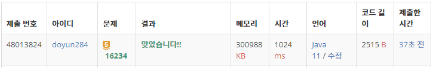

## 문제 유형
- 구현
- 그래프 이론
- 그래프 탐색
- 너비 우선 탐색
- 시뮬레이션

## 코드
```java
public static boolean move() {
        boolean flag = false;

        boolean[][] check = new boolean[N][N];
        Queue<int[]> queue = new LinkedList<>();

        for (int i=0; i<N; i++) {
           for (int j=0; j<N; j++) {
                 if (!check[i][j]) {
                    ArrayList<int[]> arr = new ArrayList<>();
                    queue.add(new int[]{i, j});
                    check[i][j] = true;
            
                    int sum = 0;
                    while (!queue.isEmpty()) {
                       int[] cur = queue.poll();
                       sum += people[cur[0]][cur[1]];
                       arr.add(new int[] {cur[0], cur[1]});
               
                       for (int k=0; k<4; k++) {
                       int curX = cur[0] + dx[k];
                       int curY = cur[1] + dy[k];
                       if (curX < 0 || curY < 0 || curX >= N || curY >= N) continue;
               
                       int diff = Math.abs(people[curX][curY] - people[cur[0]][cur[1]]);
                       if (!check[curX][curY] && diff >= L && diff <= R) {
                          queue.add(new int[]{curX, curY});
                          check[curX][curY] = true;
                          flag = true;
                       }
                    }
                 }
   
                 if (arr.size() > 0) {
                    int aver = sum / arr.size();
                    for (int[] pos : arr) people[pos[0]][pos[1]] = aver;
                 }
              }
           }
        }

        return flag;
}
```

## 로직
1. 모든 people 배열을 돌면서, 병합을 진행한다.
2. 방문하지 않은 지점일 경우, queue 안에 넣는다.
   1. 추후, 평균 값으로 바꾸기 위해 해당 지점을 ArrayList 안에도 넣는다.
   2. 상하좌우를 확인하며 L이상, R이하인 지점을 구하여 queue 안에 넣는다. 
3. ArrayList 안에 있는 지점들에 대해 평균 값으로 교체한다.



## 리뷰
메모리 사용량이 너무 크게 나왔다. 소요 시간도 짧지는 않은 것 같다. 이를 보완할 수 있는 방법을 더 생각해봐야겠다.