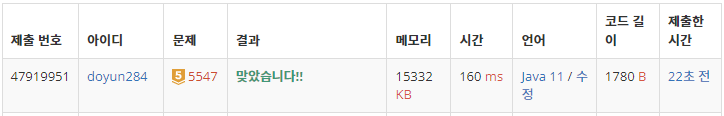

## 문제 유형
- 그래프 이론
- 그래프 탐색
- 너비 우선 탐색
- 깊이 우선 탐색

## 코드
```java
public static int[] dx = {-1, 0, 1, 1, 0, -1};
public static int[] dyEven = {-1, -1, -1, 0, 1, 0};
public static int[] dyOdd = {0, -1, 0, 1, 1, 1};

public static int bfs(int x, int y) {
        int cnt = 0;

        Queue<int[]> queue = new LinkedList<>();
        queue.add(new int[]{x, y});
        visit[x][y] = 1;

        while (!queue.isEmpty()) {
            int[] cur = queue.poll();
            int curX, curY;
    
            for (int i=0; i<6; i++) {
                curX = cur[0] + dx[i];
                if (cur[0] % 2 == 0) curY = cur[1] + dyEven[i];
                else curY = cur[1] + dyOdd[i];
        
                if (curX < 0 || curY < 0 || curX >= H+2 || curY >= W+2) continue;
                if (map[curX][curY] == 0 && visit[curX][curY] == 0) {
                    queue.add(new int[]{curX, curY});
                    visit[curX][curY] = 1;
                    continue;
                }
                if (map[curX][curY] == 1) cnt++;
            }
        }

        return cnt;
}
```

## 로직
1. dx, dyEven, dyOdd 통해 하나의 좌표에서 뻗어나갈 수 있는 6가지 방향을 지정한다. 이때, 세로축이 짝수/홀수일 경우를 나눠서 생각한다.
2. 좌표 값이 0(건물 외부)를 대상으로 큐를 이용해 BFS 진행한다.
   1. 좌표 값이 0인 지점을 대상으로 6가지 방향으로 뻗어나간다.
   2. 인접한 좌표 값이 0일 경우, 큐에 삽입한다.
   3. 인접한 좌표 값이 1일 경우, 외벽 개수를 증가시킨다.



## 리뷰
가로, 세로 방향이 헷갈려서 꽤나 시간이 오래 걸렸다. 
문제에서 제시하는 (x, y) 좌표에 너무 연연하지 말고 나만의 가로축/세로축을 정해서 풀어야겠다. 