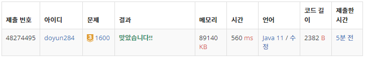

## 문제 유형
- 그래프 이론
- 그래프 탐색
- 너비 우선 탐색

## 코드
```java
static int[] hx = {-1, -2, -2, -1, 1, 2, 2, 1};
static int[] hy = {-2, -1, 1, 2, 2, 1, -1, -2};
static int[] dx = {-1, 1, 0, 0};
static int[] dy = {0, 0, -1, 1};

public static int BFS() {
    Queue<Node> queue = new LinkedList<>();
    queue.offer(new Node(0, 0, 0, 0));
    visit[0][0][0] = true;

    while (!queue.isEmpty()) {
        Node cur = queue.poll();
        if (cur.x == H-1 && cur.y == W-1) return cur.count;

        for (int i=0; i<4; i++) {
            int nx = cur.x + dx[i];
            int ny = cur.y + dy[i];
            if (nx < 0 || ny < 0 || nx >= H || ny >= W) continue;
            if (!visit[nx][ny][cur.k] && map[nx][ny] == 0) {
                queue.offer(new Node(nx, ny, cur.k, cur.count+1));
                visit[nx][ny][cur.k] = true;
            }
        }
        if (cur.k < K) {
            for (int i=0; i<8; i++) {
                int nx = cur.x + hx[i];
                int ny = cur.y + hy[i];
                if (nx < 0 || ny < 0 || nx >= H || ny >= W) continue;
                if (!visit[nx][ny][cur.k+1] && map[nx][ny] == 0) {
                    queue.offer(new Node(nx, ny, cur.k+1, cur.count+1));
                    visit[nx][ny][cur.k+1] = true;
                }
            }
        }
    }

    return -1;
}
```

## 로직
1. 큐를 이용해 너비우선탐색을 진행한다.
2. 상하좌우를 돌면서 방문하지 않은 지점이 있다면, 큐에 삽입한다.
3. 현재까지의 경로에서 말 형태의 이동이 K번 보다 적다면, 말 형태의 이동을 진행한다.
- (참고) visit 배열은 3차원으로 이루어져있는데, x좌표, y좌표, 말 형태의 이동 횟수에 대한 배열이다.



## 리뷰
visit 배열을 3차원으로 생각해내야 하는 것이 좀 어려웠다. 