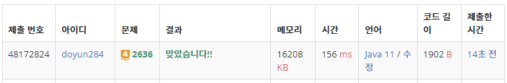

## 문제 유형
- 구현
- 그래프 이론
- 그래프 탐색
- 너비 우선 탐색
- 시뮬레이션

## 코드
```java
public static boolean checkFinish() {
        for (int i=0; i<col; i++) {
            for (int j=0; j<row; j++) {
                if (arr[i][j] == 1) return false;
            }
        }
        return true;
}

public static int BFS(int x, int y) {
        Queue<int[]> queue = new LinkedList<>();
        queue.add(new int[]{x, y});

        boolean[][] visit = new boolean[col][row];
        visit[x][y] = true;

        int cnt = 0;
        while (!queue.isEmpty()) {
            int[] cur = queue.poll();

            for (int i=0; i<4; i++) {
                int nx = cur[0] + dx[i];
                int ny = cur[1] + dy[i];
                if (nx < 0 || ny < 0 || nx >= col || ny >= row || visit[nx][ny]) continue;

                if (arr[nx][ny] == 0) queue.add(new int[]{nx, ny});
                else {
                    arr[nx][ny] = 0;
                    cnt++;
                }
                visit[nx][ny] = true;
            }
        }

        return cnt;
}
```

## 로직
1. checkFinish()를 통해 치즈가 남아있는지 확인한 다음, 치즈가 남아있는 경우 BFS 함수를 진행한다.
2. (0,0)에서 시작해서 큐를 이용하여 BFS를 진행한다.
    1. 현재 지점에서 상하좌우의 지점이 범위를 넘어가거나, 방문한 지점이라면 통과한다.
    2. 현재 지점에서 상하좌우에 치즈가 있지 않으면(0) 큐에 삽입한다.
    3. 현재 지점에서 상하좌우에 치즈가 존재하면(1) 치즈를 없앤다.



## 리뷰
전형적인 BFS 문제였다. 치즈 중간에 구멍 뚫린 부분은 공기가 닿지 않는 다는 조건을 해결하기 위해, 치즈가 없는 부분을 기준으로 BFS를 진행하였다. 