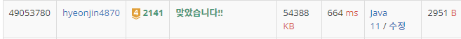

## 문제 유형
그리디 알고리즘, 정렬
## 결과

## 로직
- 마을의 개수를 모두 다 더한다.
- 우체국의 위치를 기준으로 오름차순 정렬한다.
- 순서대로 우체국 위치의 마을 합을 더하면서 전체 마을 개수의 절반의 값보다 크거나 같은 지점이 각 사람들까지의 거리의 합이 최소가 되는 위치이다.

## 리뷰
우체국의 위치를 정할 때 거리는 고려하지 않고 우체국의 개수 기준으로 풀어야하는 문제였다.
