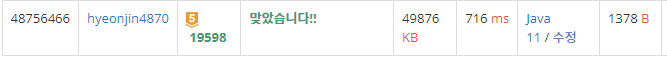

## 문제 유형
자료구조, 그리디 알고리즘, 정렬, 스위핑, 우선순위 큐
## 결과

## 로직
- 회의 시작 시각, 종료 시각을 담은 시각 배열을 선언한 후, 회의 시작 시각 기준으로 오름차순 정렬한다
- PriorityQueue에 끝나는 시각 값(end)을 넣는다(처음에는 가장 큰 값을 넣는다).
- 시각 배열을 순서대로 순회하면서 시작 시각이 priorityqueue 값보다 크거나 같으면 동일한 회의실을 사용할 수 있다는 의미이므로 poll()하고 회의실 개수 카운팅을 하지 않는다
- 만약 시작 시각이 더 작다면 poll() 하지 않고 회의실 개수 카운팅을 한다
## 리뷰
익숙한 문제라 비교적 수월하게 풀었지만
그리디 연습을 더 해야할 것같다