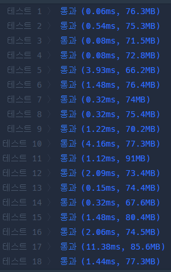

## 문제 유형
재귀
## 결과

## 로직
- 각 dfs 단계별로 현재 노드, 현재 노드까지의 양,늑대의 수, 다음에 방문할 노드 리스트를 인자로 가진다.
- 현재 노드까지 양과 늑대 수를 센다
- 만약 양>늑대 이면 유망한 노드이다. 따라서 자식 노드들을 다음에 순회할 노드 리스트에 추가한다. 또한 현재 방문한 노드는 다음에 순회할 노드 리스트에서 제거한다.
- 양<=늑대이면 유망하지 않은 노드이므로 return한다.
## 리뷰
- 결국 풀이를 봐버렸다. 이해하는데도 꽤 걸렸다ㅠㅠ
