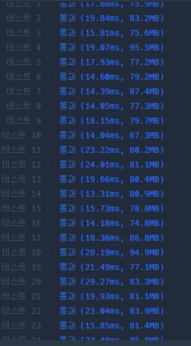

## 문제 유형
재귀, 구현
## 결과

## 로직
- 속성의 모든 조합을 구한다
- 각 조합마다 유일성 체크와 최소성 체크를 한다
- 유일성 체크는 각 행마다 속성 조합에 해당하는 튜플 값들을 하나의 문자열로 만들어서 모든 행 간에 중복체크를 한다
- 최소성 체크는 새로 들어온 속성 조합이 이전에 등록된 후보키들의 속성 조합에 포함되는지 여부를 속성 인덱스 문자열로 파악한다
## 리뷰
최소성 체크에서 contains 함수로 등록될 후보키가 등록된 후보키들에 포함되는지 파악했는데
등록될 후보키 : 013(속성 인덱스), 등록된 후보키:03인 경우에는 contains에 false값이 반환된다는 경우를 생각못했다.
