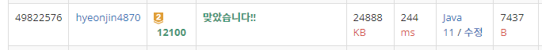

## 문제 유형
구현, DFS
## 결과

## 로직
- DFS로 상,하,좌,우로 움직이면서 숫자를 합친다.
- 각각 방향으로 움직이면서 board를 업데이트 한다
  - 아래/오른쪽에서 미는 경우는 board의 마지막 인덱스부터 업데이트 한다
  - 위/왼쪽에서 미는 경우는 board의 첫 인덱스부터 업데이트 한다
    1) 다음 인덱스가 테두리를 벗어나거나, 현재 board의 값이 0이면 아무것도 수행하지 않는다 
    2) 1)이 아니면, 다음 인덱스의 board 값과 현재 인덱스의 board값이 일치하면 합치고 최대값을 갱신한다
    2-1) 다음 인덱스의 board값이 0이면 0이 아닌 값이 나오거나 테두리 까지 해당 방향으로 민다.
## 리뷰
반례 찾는게 진짜 너무너무너무 힘들었다..
dfs인자로 이차원 배열을 주었는데 계속 참조가 되어서 문제 해결이 안됐었다.. 왜일까