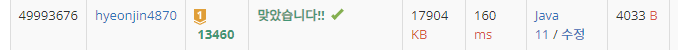

## 문제 유형
구현,BFS
## 결과

## 로직
- 처음 빨간공,파란공의 위치를 cnt=0과 함께 큐에 삽입한다.
- 위,오른쪽,아래,왼쪽으로 끝까지 굴린 좌표를 큐에 삽입한다. cnt는 1더해준다
  - 이때 두 공의 위치가 동일하다면 초기 빨간공,파란공의 위치에 따라 겹치지 않게 위치를 조절해준다.
- 빨간 공만 들어간 경우라면 해당 cnt를  리턴해준다
- 판을 움직였을 때, 공의 움직임이 없는 좌표는 큐에 넣지 않는다
- 파란 공이 구멍에 들어간 좌표는 큐에 넣지 않는다.
- 만약 cnt가 10회가 넘어가면 -1을 출력해준다
## 리뷰
복잡한 구현문제였다.. 예외 케이스 다 통과하는 실력을 길러야겠다..

