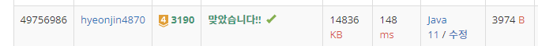

## 문제 유형
구현
## 결과

## 로직
- 뱀의 위치 정보를 Arraylist에 저장한다
- 방향을 변환해야 하면 변환을 한다. (머리가 향하는 방향 + 앞으로 나아갈 좌표 설정)
- 매순간 뱀의 머리 부분을 arraylist에 추가하고, 사과가 없으면 뱀의 꼬리 부분(arraylist(0))을 삭제한다.
## 리뷰
구현 문제를 효율적으로 푸는 방법을 더 익혀야 겠다.
(방향 변환을 dx,dy를 두어 반복하기, 뱀의 몸통 위치를 -1로 처리하여 시간 복잡도를 줄이는 방법)
