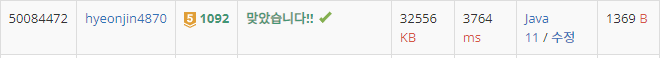

## 문제 유형
그리디, 정렬
## 결과

## 로직
- 박스와 크레인을 각각 무게와 최대 수용 가능한 무게 별로 내림차순 정렬한다.
- 1phase에서 각 크레인에 수용가능한 박스들을 제외시킨다
- 박스가 없어질 때까지 phase를 반복한다
- 만약 1phase가 끝나고 박스의 개수에 변화가 없다면 -1을 리턴한다
## 리뷰
생각보다 간단한 그리디 문제였다.

