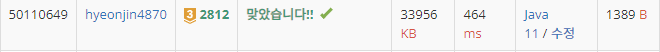

## 문제 유형
그리디, 스택
## 결과

## 로직
- 주어진 숫자를 앞자리 수부터 한 자리씩 순회한다
- 스택이 비어있거나 stack.peek()의 값이 현재 수 보다 크거나 같으면 스택에 값을 쌓는다
- 만약 stack.peek()의 값이 현재 수 보다 작으면 stack.pop()을 하고 삭제해야할 K를 감소시킨다
- K==0이되면 그때의 숫자 인덱스를 j를 저장하고 숫자 순회를 멈춘다
- 만약 K가 0이 아니면  K가 0이될때 까지 stack.pop()을 수행한다
- stack의 값을 문자열로 변환한다. 그리고 j시점부터 그 이후의 숫자도 문자열로 변환하여 더해준다
## 리뷰
계속 메모리 초과가 나서 헤맸다
이유는 최종 stack의 값을 문자열로 변환하는 과정에서 String.valueOf(char)을 써서 계속 새로운 문자열 객체를 위한 메모리를 참조했기 때문이다.
Stringbuffer의 append를 사용하여 해결하였다.

